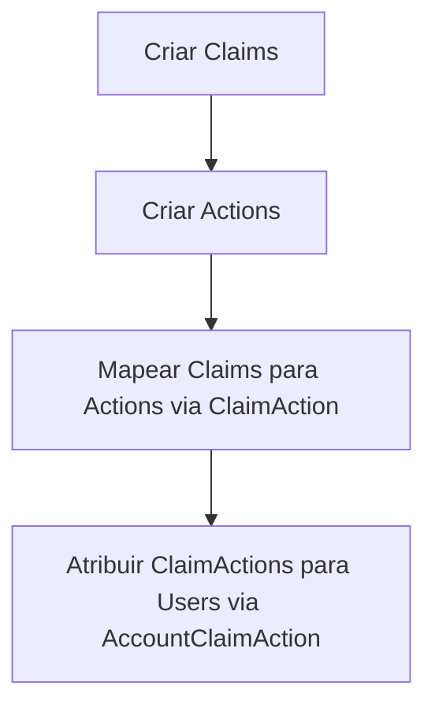
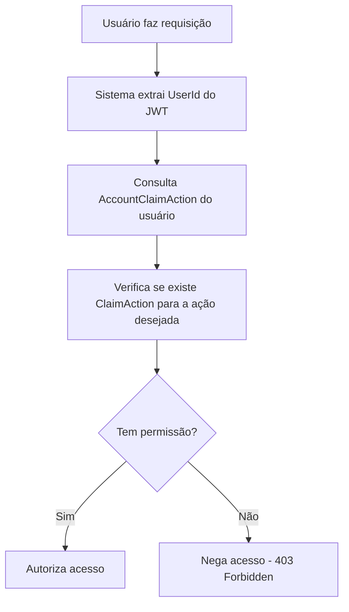

# 🔐 RBAC Architecture - Sistema Completo de Permissões

Este documento detalha a implementação do sistema RBAC (Role-Based Access Control) utilizando o padrão de Claims, Actions e mapeamentos relacionais.

## 📋 Índice

- [Visão Geral do RBAC](#visão-geral-do-rbac)
- [Entidades do Sistema](#entidades-do-sistema)
- [Relacionamentos](#relacionamentos)
- [Fluxo de Autorização](#fluxo-de-autorização)
- [Implementação Prática](#implementação-prática)
- [Exemplos de Uso](#exemplos-de-uso)

## 🏛️ Visão Geral do RBAC

O sistema RBAC implementado permite controle granular de permissões através de uma arquitetura flexível que separa:

- **WHO** (Quem): Account (Usuários)
- **WHAT** (O que): Action (Ações do sistema)
- **HOW** (Como): Claim (Permissões/Roles)
- **MAPPING** (Mapeamento): ClaimAction (Quais ações cada permissão permite)
- **ASSIGNMENT** (Atribuição): AccountClaimAction (Quais permissões cada usuário possui)

## 🗂️ Entidades do Sistema

### 1. **Account** - Usuários do Sistema
```csharp
public class Account : Entity
{
    public string UserName { get; private set; }
    public string Password { get; private set; }
    public DateTime CreatedAt { get; private set; }
    public DateTime UpdatedAt { get; private set; }
    
    // Relacionamentos
    public virtual ICollection<AccountClaimAction> AccountClaimActions { get; set; }
    
    // Métodos de negócio
    public void UpdatePassword(string newPassword)
    {
        Password = StringHelper.ComputeArgon2Hash(newPassword);
        UpdatedAt = DateTime.UtcNow;
    }
    
    public bool VerifyPassword(string password)
    {
        return StringHelper.VerifyArgon2Hash(password, Password);
    }
}
```

### 2. **Claim** - Permissões/Roles
```csharp
public class Claim : Entity
{
    public string Type { get; private set; }      // Ex: "Role", "Permission", "Feature"
    public string Value { get; private set; }     // Ex: "Admin", "user:read", "reports"
    public string Description { get; private set; } // Descrição human-readable
    public DateTime CreatedAt { get; private set; }
    public DateTime UpdatedAt { get; private set; }
    
    // Relacionamentos
    public virtual ICollection<ClaimAction> ClaimActions { get; set; }
    
    // Construtor
    public Claim(string type, string value, string description)
    {
        Type = type;
        Value = value;
        Description = description;
        CreatedAt = DateTime.UtcNow;
        UpdatedAt = DateTime.UtcNow;
    }
}
```

### 3. **Action** - Ações do Sistema
```csharp
public class Action : Entity
{
    public string Name { get; private set; }      // Ex: "CreateUser", "DeletePost", "ViewReports"
    public DateTime CreatedAt { get; private set; }
    public DateTime UpdatedAt { get; private set; }
    
    // Relacionamentos
    public virtual ICollection<ClaimAction> ClaimActions { get; set; }
    
    // Construtor
    public Action(string name)
    {
        Name = name;
        CreatedAt = DateTime.UtcNow;
        UpdatedAt = DateTime.UtcNow;
    }
}
```

### 4. **ClaimAction** - Mapeamento Claim ↔ Action
```csharp
public class ClaimAction : Entity
{
    public int ClaimId { get; private set; }
    public int ActionId { get; private set; }
    public DateTime CreatedAt { get; private set; }
    public DateTime UpdatedAt { get; private set; }
    
    // Relacionamentos
    public virtual Claim Claim { get; set; }
    public virtual Action Action { get; set; }
    public virtual ICollection<AccountClaimAction> AccountClaimActions { get; set; }
    
    // Construtor
    public ClaimAction(int claimId, int actionId)
    {
        ClaimId = claimId;
        ActionId = actionId;
        CreatedAt = DateTime.UtcNow;
        UpdatedAt = DateTime.UtcNow;
    }
}
```

### 5. **AccountClaimAction** - Permissões do Usuário
```csharp
public class AccountClaimAction : Entity
{
    public int AccountId { get; private set; }
    public int ClaimActionId { get; private set; }
    public DateTime CreatedAt { get; private set; }
    public DateTime UpdatedAt { get; private set; }
    
    // Relacionamentos
    public virtual Account Account { get; set; }
    public virtual ClaimAction ClaimAction { get; set; }
    
    // Construtor
    public AccountClaimAction(int accountId, int claimActionId)
    {
        AccountId = accountId;
        ClaimActionId = claimActionId;
        CreatedAt = DateTime.UtcNow;
        UpdatedAt = DateTime.UtcNow;
    }
}
```

## 🔗 Relacionamentos

### Diagrama de Relacionamentos:
```
    Account (1) ←→ (N) AccountClaimAction (N) ←→ (1) ClaimAction
                                                        ↓
                                          Claim (1) ←→ (N) ClaimAction (N) ←→ (1) Action
```

### Explicação dos Relacionamentos:

1. **Account → AccountClaimAction** (1:N)
   - Um usuário pode ter múltiplas permissões
   
2. **ClaimAction → AccountClaimAction** (1:N)
   - Uma combinação claim-action pode ser atribuída a múltiplos usuários
   
3. **Claim → ClaimAction** (1:N)
   - Uma claim pode permitir múltiplas ações
   
4. **Action → ClaimAction** (1:N)
   - Uma ação pode ser permitida por múltiplas claims

## 🔄 Fluxo de Autorização

### 1. **Setup do Sistema de Permissões**


### 2. **Verificação de Permissão em Runtime**


## 💻 Implementação Prática

### 1. **Serviços de Gerenciamento**

#### ClaimService:
```csharp
public class ClaimService : IClaimService
{
    private readonly ILoginUnitOfWork _unitOfWork;
    
    public async Task<ClaimResponseDTO> CreateClaimAsync(ClaimRequestDTO request)
    {
        var claim = new Claim(request.Type, request.Value, request.Description);
        
        await _unitOfWork.ClaimRepository.AddAsync(claim);
        await _unitOfWork.CommitAsync();
        
        return claim.MapToResponseDTO();
    }
    
    public async Task<IEnumerable<ClaimResponseDTO>> GetClaimsAsync()
    {
        var claims = await _unitOfWork.ClaimRepository.GetAllAsync();
        return claims.Select(c => c.MapToResponseDTO());
    }
}
```

#### ClaimActionService:
```csharp
public class ClaimActionService : IClaimActionService
{
    private readonly ILoginUnitOfWork _unitOfWork;
    
    public async Task<ClaimActionResponseDTO> CreateClaimActionAsync(ClaimActionRequestDTO request)
    {
        // Validar se Claim e Action existem
        var claimExists = await _unitOfWork.ClaimRepository.ExistsAsync(request.ClaimId);
        var actionExists = await _unitOfWork.ActionRepository.ExistsAsync(request.ActionId);
        
        if (!claimExists || !actionExists)
            throw new ValidationException("Claim ou Action não encontrados");
        
        var claimAction = new ClaimAction(request.ClaimId, request.ActionId);
        
        await _unitOfWork.ClaimActionRepository.AddAsync(claimAction);
        await _unitOfWork.CommitAsync();
        
        return claimAction.MapToResponseDTO();
    }
}
```

#### AccountClaimActionService:
```csharp
public class AccountClaimActionService : IAccountClaimActionService
{
    private readonly ILoginUnitOfWork _unitOfWork;
    
    public async Task AssignPermissionToUserAsync(int accountId, int claimActionId)
    {
        // Verificar se já existe a atribuição
        var existingAssignment = await _unitOfWork.AccountClaimActionRepository
            .GetByAccountAndClaimActionAsync(accountId, claimActionId);
            
        if (existingAssignment != null)
            throw new ValidationException("Permissão já atribuída ao usuário");
        
        var accountClaimAction = new AccountClaimAction(accountId, claimActionId);
        
        await _unitOfWork.AccountClaimActionRepository.AddAsync(accountClaimAction);
        await _unitOfWork.CommitAsync();
    }
    
    public async Task<IEnumerable<PermissionResponseDTO>> GetUserPermissionsAsync(int accountId)
    {
        return await _unitOfWork.AccountClaimActionRepository
            .GetUserPermissionsWithDetailsAsync(accountId);
    }
}
```

### 2. **Controllers REST API**

#### ClaimController:
```csharp
[ApiController]
[Route("[controller]")]
[Authorize] // Requer autenticação
public class ClaimController : ControllerBase
{
    private readonly IClaimService _claimService;
    
    [HttpGet(ClaimRoutes.GetClaims)]
    public async Task<IActionResult> GetClaims()
    {
        var claims = await _claimService.GetClaimsAsync();
        return Ok(claims);
    }
    
    [HttpPost(ClaimRoutes.AddClaim)]
    public async Task<IActionResult> CreateClaim([FromBody] ClaimRequestDTO request)
    {
        var claim = await _claimService.CreateClaimAsync(request);
        return CreatedAtAction(nameof(GetClaimById), new { id = claim.Id }, claim);
    }
}
```

### 3. **Middleware de Autorização Customizado**
```csharp
public class RBACAuthorizationMiddleware
{
    private readonly RequestDelegate _next;
    
    public async Task InvokeAsync(HttpContext context, IAccountClaimActionService permissionService)
    {
        // Verificar se a rota requer autorização específica
        var endpoint = context.GetEndpoint();
        var requiredAction = endpoint?.Metadata.GetMetadata<RequiredActionAttribute>()?.ActionName;
        
        if (!string.IsNullOrEmpty(requiredAction))
        {
            var userId = GetUserIdFromToken(context);
            var hasPermission = await permissionService.UserHasPermissionForActionAsync(userId, requiredAction);
            
            if (!hasPermission)
            {
                context.Response.StatusCode = 403;
                await context.Response.WriteAsync("Acesso negado: permissão insuficiente");
                return;
            }
        }
        
        await _next(context);
    }
}

// Atributo para marcar ações que requerem permissões específicas
[AttributeUsage(AttributeTargets.Method)]
public class RequiredActionAttribute : Attribute
{
    public string ActionName { get; }
    
    public RequiredActionAttribute(string actionName)
    {
        ActionName = actionName;
    }
}
```

## 📝 Exemplos de Uso

### 1. **Configuração Inicial do Sistema**
```csharp
// 1. Criar Claims (Roles/Permissões)
var adminClaim = new Claim("Role", "Administrator", "Acesso completo ao sistema");
var editorClaim = new Claim("Role", "Editor", "Pode editar conteúdo");
var viewerClaim = new Claim("Permission", "user:read", "Pode visualizar usuários");

// 2. Criar Actions (Ações do Sistema)
var createUserAction = new Action("CreateUser");
var editUserAction = new Action("EditUser");
var deleteUserAction = new Action("DeleteUser");
var viewUserAction = new Action("ViewUser");

// 3. Mapear Claims para Actions
var adminCanCreateUsers = new ClaimAction(adminClaim.Id, createUserAction.Id);
var adminCanEditUsers = new ClaimAction(adminClaim.Id, editUserAction.Id);
var adminCanDeleteUsers = new ClaimAction(adminClaim.Id, deleteUserAction.Id);
var adminCanViewUsers = new ClaimAction(adminClaim.Id, viewUserAction.Id);

var editorCanViewUsers = new ClaimAction(editorClaim.Id, viewUserAction.Id);
var editorCanEditUsers = new ClaimAction(editorClaim.Id, editUserAction.Id);

var viewerCanViewUsers = new ClaimAction(viewerClaim.Id, viewUserAction.Id);

// 4. Atribuir permissões aos usuários
var userAdminPermission = new AccountClaimAction(adminUser.Id, adminCanCreateUsers.Id);
var userEditorPermission = new AccountClaimAction(editorUser.Id, editorCanViewUsers.Id);
```

### 2. **Uso nos Controllers**
```csharp
[HttpPost("users")]
[RequiredAction("CreateUser")]
public async Task<IActionResult> CreateUser([FromBody] CreateUserRequest request)
{
    // Só executará se o usuário tiver a permissão "CreateUser"
    var user = await _userService.CreateAsync(request);
    return Ok(user);
}

[HttpGet("users")]
[RequiredAction("ViewUser")]
public async Task<IActionResult> GetUsers()
{
    // Só executará se o usuário tiver a permissão "ViewUser"
    var users = await _userService.GetAllAsync();
    return Ok(users);
}
```

### 3. **API Calls para Gerenciar Permissões**
```bash
# Criar uma nova claim
POST /Claim/AddClaim
{
  "type": "Role",
  "value": "ContentManager",
  "description": "Gerencia conteúdo do sistema"
}

# Criar uma nova ação
POST /Action/AddAction
{
  "name": "PublishContent"
}

# Mapear claim para ação
POST /ClaimAction/AddClaimAction
{
  "claimId": 1,
  "actionId": 5
}

# Atribuir permissão a usuário
POST /AccountClaimAction/AddAccountClaimAction
{
  "accountId": 10,
  "claimActionId": 15
}
```

## 🎯 Vantagens desta Implementação

✅ **Flexibilidade**: Permissões granulares por ação específica  
✅ **Escalabilidade**: Fácil adição de novas permissões e ações  
✅ **Auditoria**: Controle completo de quem tem acesso ao que  
✅ **Separação**: Claims, Actions e mapeamentos independentes  
✅ **Reutilização**: Combinações de permissões reutilizáveis  
✅ **Performance**: Consultas otimizadas com relacionamentos bem definidos  

Esta arquitetura RBAC oferece controle total sobre permissões de forma escalável e maintível!