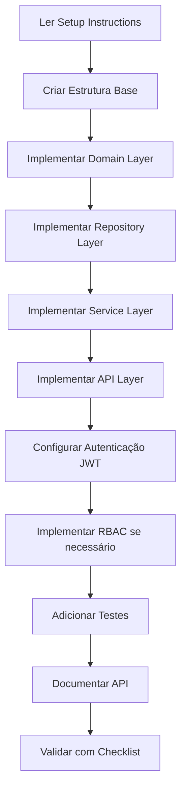

# 🏗️ Default Template - Arquitetura e Padrões

Este template contém toda a arquitetura, padrões e convenções utilizadas no projeto Authentication. Use este template como base para criar novos projetos seguindo os mesmos padrões estabelecidos.

## 📋 Índice

- [Visão Geral da Arquitetura](#visão-geral-da-arquitetura)  
- [Estrutura de Pastas](#estrutura-de-pastas)
- [Padrões Implementados](#padrões-implementados)
- [Como Usar Este Template](#como-usar-este-template)
- [Dependências Obrigatórias](#dependências-obrigatórias)

## 🏛️ Visão Geral da Arquitetura

Este projeto segue os princípios de **Clean Architecture** e **Domain-Driven Design (DDD)**, organizados em camadas bem definidas:

```
┌─────────────────────────────────────────────┐
│                 API Layer                   │ ← Controllers, Middleware, Swagger
├─────────────────────────────────────────────┤
│              Application Layer              │ ← Services, DTOs, Business Logic
├─────────────────────────────────────────────┤
│             Infrastructure Layer            │ ← Repositories, EF Mappings, Data Access
├─────────────────────────────────────────────┤
│                Domain Layer                 │ ← Entities, Interfaces, Core Business Rules
└─────────────────────────────────────────────┘
```

### Princípios Fundamentais

1. **Inversão de Dependência**: Camadas externas dependem de interfaces das camadas internas
2. **Separação de Responsabilidades**: Cada camada tem uma responsabilidade específica
3. **Testabilidade**: Estrutura permite testes unitários e de integração eficazes
4. **Extensibilidade**: Fácil adição de novas funcionalidades sem quebrar o existente

## 📁 Estrutura de Pastas

```
Projeto/
├── Solution/                          # Configuração da Solução Visual Studio
│   ├── Projeto.sln                   # Arquivo de solução
│   └── Claim.cs                      # Classe auxiliar (se necessário)
│
├── Src/                              # Código fonte principal
│   ├── Projeto.API/                  # 🌐 Camada de Apresentação (API)
│   │   ├── Controllers/              # Controllers da API REST
│   │   ├── Middleware/               # Middleware customizado
│   │   ├── Swagger/                  # Configuração e documentação API
│   │   ├── Data/                     # Contextos específicos da API
│   │   ├── Resource/                 # Recursos de localização
│   │   ├── Program.cs                # Configuração e startup da aplicação
│   │   └── appsettings.*.json        # Configurações por ambiente
│   │
│   ├── Projeto.Domain/               # 🏛️ Camada de Domínio (Core Business)
│   │   ├── Domain/                   # Entidades e regras de negócio
│   │   │   ├── Implementation/       # Implementações concretas das entidades
│   │   │   └── Interface/           # Contratos de domínio
│   │   ├── Services/                 # Serviços de aplicação
│   │   │   ├── Implementation/       # Implementações dos serviços
│   │   │   └── Interface/           # Contratos dos serviços
│   │   ├── Repository/               # Padrão Repository
│   │   │   ├── Implementation/       # Implementações dos repositórios
│   │   │   └── Interface/           # Contratos dos repositórios
│   │   ├── Infrastructure/           # Configurações de persistência
│   │   │   ├── Implementation/       # Mapeamentos EF Core
│   │   │   └── Interface/           # Contratos de contexto
│   │   ├── UnitOfWork/              # Padrão Unit of Work
│   │   │   ├── Implementation/       # Implementação do UoW
│   │   │   └── Interface/           # Contrato do UoW
│   │   ├── DTO/                     # Data Transfer Objects
│   │   ├── Mapping/                 # Mapeamentos de objetos
│   │   ├── Util/                    # Utilitários específicos
│   │   ├── Extensions/              # Métodos de extensão
│   │   └── Resource/                # Recursos de localização
│   │
│   └── Projeto.Tests/                # 🧪 Testes
│       ├── Unit/                     # Testes unitários
│       ├── Integration/              # Testes de integração
│       ├── Fixtures/                 # Dados de teste
│       └── Helpers/                  # Auxiliares de teste
│
├── docs/                             # 📚 Documentação técnica
│   ├── ARCHITECTURE.md               # Documentação da arquitetura
│   ├── API.md                       # Documentação da API
│   └── ...                         # Outras documentações
│
└── Default template/                 # 🎯 Este template
    ├── README.md                    # Este arquivo
    ├── Architecture/                # Documentação da arquitetura
    ├── Code-Templates/              # Templates de código
    ├── Project-Structure/           # Estrutura base do projeto
    └── Setup-Instructions/          # Instruções de configuração
```

## 🎯 Padrões Implementados

### 1. **Clean Architecture**
- Separação clara entre camadas
- Inversão de dependências
- Regras de negócio isoladas no domínio

### 2. **Repository Pattern**
- Abstração do acesso a dados
- Interface/Implementação para testabilidade
- Operações CRUD padronizadas

### 3. **Unit of Work Pattern**
- Gerenciamento de transações
- Controle de contexto de dados
- Atomicidade das operações

### 4. **Service Layer Pattern**
- Lógica de negócio centralizada
- Orquestração entre repositórios
- Validações e regras de negócio

### 5. **DTO Pattern**
- Transferência de dados entre camadas
- Mapeamento de entidades para DTOs
- Validação de entrada

### 6. **RBAC (Role-Based Access Control)**
- Sistema completo de permissões
- Entidades: Claims, Actions, ClaimActions, AccountClaimActions
- Autorização granular por funcionalidade

### 7. **JWT Authentication/Authorization**
- Autenticação baseada em tokens
- Claims personalizadas
- Middleware de autorização

### 8. **Dependency Injection**
- Inversão de controle
- Configuração centralizada
- Extensões para registro de serviços

## 🚀 Como Usar Este Template

### 1. **Copiar Estrutura Base**
```bash
# Copie toda a pasta "Default template" para seu novo projeto
cp -r "Default template" /caminho/para/novo-projeto/

# Renomeie conforme seu projeto
# Substitua "Projeto" pelo nome do seu projeto em todos os arquivos
```

### 2. **Configurar Dependências**
- Clone o repositório Foundation junto ao seu projeto
- Configure as referências de projeto
- Instale os pacotes NuGet necessários

### 3. **Personalizar para Seu Domínio**
- Substitua as entidades de exemplo pelas suas
- Adapte os serviços para sua lógica de negócio
- Configure as permissões específicas do seu sistema

### 4. **Configurar Banco de Dados**
- Configure a string de conexão
- Execute as migrations
- Configure os dados iniciais

## 📦 Dependências Obrigatórias

### Foundation.Base Library
```xml
<!-- Deve estar no mesmo diretório pai -->
<ProjectReference Include="..\..\Foundation\Src\Foundation.Base\Foundation.Base.csproj" />
```

### Pacotes NuGet Essenciais
- Microsoft.EntityFrameworkCore
- Microsoft.AspNetCore.Authentication.JwtBearer
- FluentValidation.AspNetCore
- Swashbuckle.AspNetCore
- Pomelo.EntityFrameworkCore.MySql

## 📝 Documentação Completa

### 🏗️ **Arquitetura**
- **[Clean Architecture Implementation](Architecture/Clean-Architecture-Implementation.md)** - Implementação detalhada da Clean Architecture
- **[RBAC System Architecture](Architecture/RBAC-System-Architecture.md)** - Sistema completo de permissões
- **[JWT Authentication Pattern](Architecture/JWT-Authentication-Pattern.md)** - Implementação de autenticação JWT

### 🧩 **Templates de Código**
- **[Code Templates](Code-Templates/README.md)** - Templates para todas as camadas (Domain, Services, Repository, API)

### 📁 **Estrutura do Projeto**
- **[Project Structure](Project-Structure/README.md)** - Estrutura completa de pastas e arquivos

### 🚀 **Configuração**
- **[Setup Instructions](Setup-Instructions/README.md)** - Instruções passo a passo para novo projeto
- **[Configuration Checklist](Setup-Instructions/Configuration-Checklist.md)** - Checklist completo de configuração

## 📋 Índice de Recursos

| Recurso | Descrição | Localização |
|---------|-----------|-------------|
| 🏛️ **Entidades de Domínio** | Templates para Account, Claims, Actions | `Code-Templates/README.md` |
| 🔧 **Serviços** | Padrões de Service Layer com DI | `Code-Templates/README.md` |
| 🗃️ **Repositórios** | Repository Pattern + Unit of Work | `Code-Templates/README.md` |
| 🌐 **Controllers API** | REST API com Swagger | `Code-Templates/README.md` |
| 📦 **DTOs** | Request/Response DTOs + Validation | `Code-Templates/README.md` |
| 🔐 **Autenticação JWT** | Implementação completa JWT | `Architecture/JWT-Authentication-Pattern.md` |
| 👥 **Sistema RBAC** | Claims, Actions, Permissions | `Architecture/RBAC-System-Architecture.md` |
| 🏗️ **Configuração EF** | Entity Framework + Mappings | `Setup-Instructions/README.md` |
| 🧪 **Templates de Teste** | Unit + Integration Tests | `Code-Templates/README.md` |
| 📚 **Documentação Swagger** | API Documentation | `Setup-Instructions/README.md` |

## 🎯 Como Usar Este Template

### 1. **Para Novo Projeto Completo**
```bash
# Siga as instruções passo a passo:
1. Leia: Setup-Instructions/README.md
2. Use: Setup-Instructions/Configuration-Checklist.md
3. Implemente: Code-Templates/README.md
```

### 2. **Para Adicionar Funcionalidade RBAC**
```bash
# Se já tem um projeto e quer adicionar RBAC:
1. Leia: Architecture/RBAC-System-Architecture.md
2. Implemente: Code-Templates/README.md (seções Claims/Actions)
```

### 3. **Para Implementar JWT**
```bash
# Para adicionar autenticação JWT:
1. Leia: Architecture/JWT-Authentication-Pattern.md
2. Configure: Setup-Instructions/README.md (seção JWT)
```

### 4. **Para Entender a Arquitetura**
```bash
# Para compreender os padrões:
1. Leia: Architecture/Clean-Architecture-Implementation.md
2. Explore: Project-Structure/README.md
```

## 🔄 Fluxo de Implementação Recomendado



## 🎨 Customização

Este template é **altamente customizável**:

- ✅ **Mantenha** os princípios arquiteturais fundamentais
- ✅ **Adapte** as entidades para seu domínio específico
- ✅ **Estenda** com novas funcionalidades seguindo os padrões
- ✅ **Remova** componentes desnecessários (ex: RBAC se não precisar)

## 🤝 Contribuindo para o Template

Se você identificar melhorias ou novos padrões:

1. **Documente** o padrão seguindo o formato estabelecido
2. **Adicione** exemplos de código práticos
3. **Atualize** o checklist de configuração
4. **Teste** a implementação em um projeto real

---

## 💡 Filosofia do Template

> "Este template não é apenas código de exemplo, é um **guia arquitetural completo** que garante consistência, qualidade e manutenibilidade em todos os seus projetos .NET."

### Princípios Fundamentais:
1. **Consistência** - Mesmos padrões em todos os projetos
2. **Qualidade** - Código limpo e bem estruturado  
3. **Manutenibilidade** - Fácil de entender e modificar
4. **Escalabilidade** - Cresce com suas necessidades
5. **Testabilidade** - Totalmente testável por design

### Resultado Esperado:
Ao usar este template, você terá projetos com:
- 🏛️ **Arquitetura sólida** e bem definida
- 🔐 **Segurança** robusta por padrão
- 📊 **Qualidade** de código consistente
- 🧪 **Cobertura de testes** abrangente
- 📚 **Documentação** completa e atualizada

**Use este template como sua base arquitetural padrão para todos os projetos .NET!**